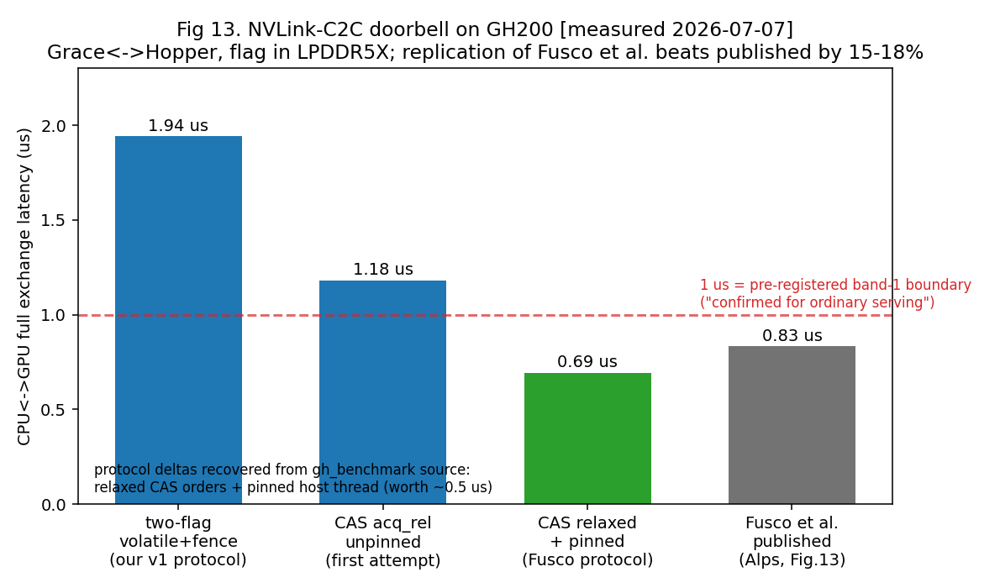
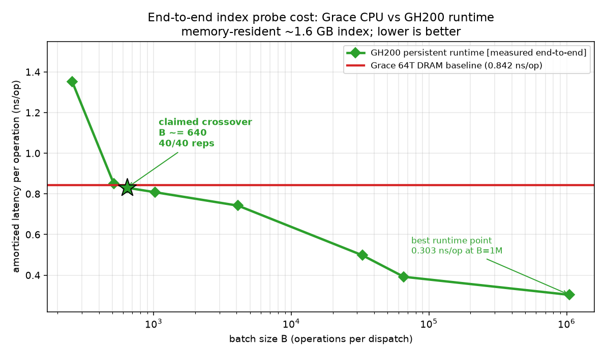
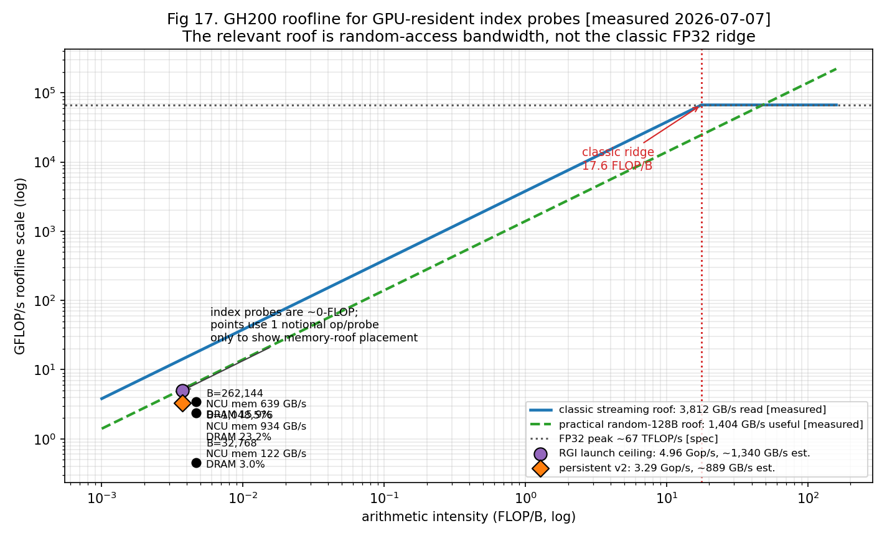

# GPU-OLTP on Grace-Hopper: Measured

## Turning the C2C dispatch bet into on-hardware numbers

&nbsp;

**Rutwik Pandit** · CMU ECE  
Advisors: Andy Pavlo · Phil Gibbons

&nbsp;

Update talk · everything here is `[measured]` on a rented GH200, July 2026

---

# Recap: What We Already Built

```text
psql -> PostgreSQL -> writeable FDW -> shared GPU worker
     -> RGI chain hash index, resident in GPU memory
```

- Real SQL `INSERT/SELECT/UPDATE/DELETE` on a GPU-resident index:
  PK enforcement, read-your-writes, equality pushdown, atomic
  validate-then-apply commits.
- Prior result: **on PCIe, CPU wins ordinary OLTP** because dispatch
  cost dominates.
- This talk resolves the open question: does coherent Grace-Hopper
  make the dispatch path cheap enough?

> Short answer: yes, for memory-resident, high-throughput batched
> index probes. The measured crossover is **B ≈ 640**, not projected.

---

# What Changed on GH200

```text
NVIDIA GH200 480GB superchip  (Lambda Cloud, C2C mode enabled)

GRACE CPU                    NVLink-C2C              HOPPER GPU
64x Neoverse-V2  <-------------------------------->  H100, 132 SMs
452 GB LPDDR5X        cache-coherent 64 B lines      96 GB HBM3
```

| measured constant | value |
| --- | ---: |
| H100 RGI find ceiling, ~1.6 GB table | **4,964 Mop/s** |
| Grace 64T baseline, same regime | **1,187 Mop/s** |
| coherent doorbell `D` | **0.68-1.2 us** |
| launch dispatch floor, B=1 | **4.1 us** |

Workload for the headline result: uniform random point lookups over a
**64 million-key / ~1.6 GB RGI table** in HBM. It is ~32x larger than
Hopper L2; Nsight reports only **~7.4% L2 hit rate**.

---

# Doorbell: The Fixed Cost Fell



- Replicated Fusco et al.'s GH200 doorbell experiment: single CAS flag,
  relaxed orders, pinned host thread.
- Measured **0.68-0.71 us** full Grace↔Hopper exchange vs their
  published **0.833 us**.
- More conservative protocol variants bracket the engineering target:
  ordered CAS ~1.1-1.3 us; two-flag + fence ~1.7-1.9 us.

The projected number is gone. The interconnect is fast enough to build
around, but only if we cross it sparingly.

---

# Doorbell Bars: What Each Method Means

```text
two-flag volatile+fence
  Our first conservative protocol: CPU writes one flag, GPU writes
  another back, with explicit system fences. Correct, but slow.

CAS acq_rel, unpinned
  One shared atomic flag with acquire/release ordering, but the CPU
  thread is allowed to move across cores. Better, still noisy.

CAS relaxed + pinned
  The adopted fast path: one atomic flag, relaxed ordering, CPU thread
  pinned. This replicates Fusco's released benchmark structure.

Fusco et al. published
  The literature reference number for the same GH200-style doorbell.
```

The bar that matters operationally is **CAS relaxed + pinned**:
~0.68 us for a full Grace↔Hopper exchange.

---

# Current Runtime Architecture

```text
GRACE host                 NVLink-C2C       HOPPER resident kernel

requests/results in HBM                    8 dispatcher CTAs
CPU posts one 8-byte word ───────────────▶ poll ring + fan out
{count|offset|gen|uniq}                    to private mailboxes

                                           1,312 serving CTAs
CPU waits on one done byte ◀────────────── run RGI cooperative_find
                                           last arriver posts done
```

```text
Cross-C2C traffic per batch:
  one 8-byte descriptor + one done byte
```

Single unified persistent kernel, ~10 CTAs/SM. Dispatchers are CTAs
inside the grid, not dedicated SMs.

---

# Why This Runtime Works

```text
design requirement                 mechanism
--------------------------------   ----------------------------------
no per-batch CUDA call             persistent kernel
no per-batch payload copy          requests/results live in HBM
no host-side N mailbox writes      GPU dispatchers fan out
no global polling by all blocks    private per-block mailboxes
no giant CPU completion scan       last arriver writes one done byte
```

The design rule is simple:

> **Cross C2C once per batch. Do scheduling on the GPU.**

Alternatives were measured and lost: CPU-written mailboxes made the
host the bottleneck; zero-copy payload made every key dereference a
C2C round trip; global polling burned L2 traffic.

---

# Pipelining: How B≈640 Happens

```text
SYNC, one batch in flight:
  post -> wait -> post -> wait
  crossover: B = 65,536

PIPELINED, up to 64 in flight on disjoint block sets:
  batch1 blocks[0..79]      [probes ---- done]
  batch2 blocks[80..159]       [probes ---- done]
  batch3 blocks[160..239]         [probes ---- done]
  crossover: B ~= 640
```

This is the fair comparison: the CPU baseline is already 64 saturated
threads with full queues. The GPU serving path also needs enough
independent work to hide random-HBM pointer-chase latency.

---

# What Timing Includes

```text
INCLUDED, measured path:
  CPU posts descriptor
  GPU dispatcher observes it and fans out
  serving CTAs run RGI probes
  last arriver signals completion
  CPU observes done byte

EXCLUDED:
  SQL parse/plan/execute
  FDW tuple materialization
  per-batch payload generation
```

So the label is:

> **End-to-end for the GH200 engine dispatch path**, not full
> PostgreSQL-over-C2C yet. The SQL coalescer that feeds this runtime is
> the next build.

---

# Headline: End-to-End Crossover



| path | measured point | interpretation |
| --- | ---: | --- |
| Grace 64T, DRAM-resident | **0.842 ns/op** | saturated CPU baseline |
| persistent runtime, B≈640 | **~0.83 ns/op** | claimed crossover |
| persistent runtime, B=1M | **~0.30 ns/op** | best runtime point |

Below B≈640, dispatch dominates. Above it, the GPU's parallelism wins.

---

# Throughput View


| comparison | result |
| --- | ---: |
| current runtime vs Grace DRAM | **3.3 / 1.187 = 2.8x** |
| raw RGI kernel vs Grace DRAM | **4.964 / 1.187 = 4.2x** |
| runtime vs raw RGI ceiling | **3.3 / 4.964 = 66%** |

> Runtime peak: **3.3 Gop/s** at B=1M. Remaining third vs raw kernel:
> protocol/scheduling overhead.

---

# Why Not 90% of HBM?



- Streaming read reaches **3.81 TB/s** (~95% of peak).
- RGI find is random pointer chasing, so the practical roof is the
  measured random-access ceiling: **~1.40 TB/s** at 64-128 B granules.
- Nsight on launch-path find, B=1M: **934 GB/s**, 23% DRAM peak,
  **7.4% L2 hit**, ~32% long-scoreboard stalls.
- Runtime estimate: `3.3 Gop/s x ~270 B/probe ≈ 0.89 TB/s`, or
  **~63% of the random-access roof**.

This is MLP/random-access limited, not streaming-bandwidth limited.

---

# Where This Wins

**Winning region:** high-throughput, memory-resident, batched serving.
B≈640 is below the fan-out of several realistic OLTP-adjacent paths.

```text
strong fit                          natural batch shape
---------------------------------   -------------------------------
feature stores / online ML          500-5,000 lookups/request
recommendation scoring              1k-10k candidates/query
fraud / risk / graph fan-out        100s of entity lookups/decision

fit with coalescing
high-QPS KV/session/cache serving   fuse many small requests -> batch
```

Anti-fit: isolated single-row latency, range/join/aggregate on
`kv_rgi`, hot-key skewed writes.

---

# What Is Still Missing

```text
SQL over runtime       engine dispatch path exists; SQL coalescer unbuilt

read evidence          crossover is YCSB-C uniform FIND;
                       writes are correctness-only so far

transactional scope    atomic commit + read-your-writes;
                       no write-write OCC, no WAL

runtime headroom       3.3 vs 4.96 Gop/s = protocol overhead;
                       small-key fast path designed, not built
```

The gaps are scope boundaries, not holes in the claim. Every number
shown here is measured.

---

# Takeaway

> On PCIe, the CPU won because dispatch erased the GPU index advantage.
> On GH200, the measured C2C doorbell plus a persistent GPU-side
> dispatch runtime makes the advantage show up end-to-end.

```text
doorbell                0.68 us measured
memory-resident GPU     4.2x raw index ceiling over Grace
runtime crossover       B ~= 640, measured 40/40 reps
runtime peak            3.3 Gop/s = 2.8x Grace DRAM baseline
```

**Result:** coherent CPU-GPU hardware makes transactional GPU storage
practical for high-throughput, memory-resident OLTP index serving.
