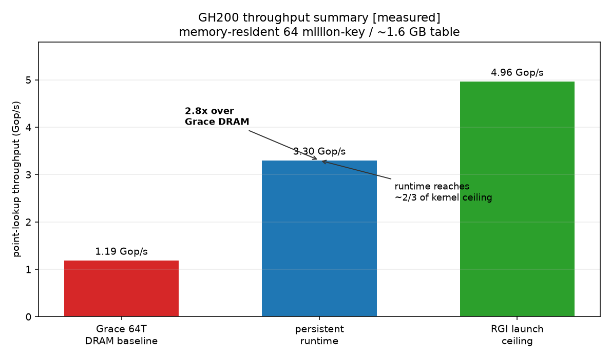

# Persistent GPU Index Runtime

## Grace-Hopper control path, scheduling, and synchronization

&nbsp;

**Rutwik Pandit** | CMU ECE<br>
Advisors: Andy Pavlo | Phil Gibbons

&nbsp;

GH200 architecture review

<!--
[Sources]
- engine/rgi_persist2.cu
- bench/gh200_campaign_results.md
-->

---

# Frontend To Persistent Backend

```text
SQL clients -> PostgreSQL backends -> writable FDW -> shared GPU service
                                                        |
                         CPU FRONTEND / INTEGRATION      |
                  reserve request and result slots      |
                  coalesce by size or deadline          |
                  write request payload into HBM        |
                  publish one batch descriptor          |
                                                        v
                         PERSISTENT GPU BACKEND
       g_ring -> dispatchers -> CTA mailboxes -> RGI chain table -> results -> done
                                                        |
                  acquire completion, demultiplex results
                                                        |
                                                        v
                         PostgreSQL backend -> SQL client
```

The GPU kernel starts once. After startup, the service uses coherent memory
operations for submission and completion; there is no CUDA call per batch.

| Layer | Current status |
| --- | --- |
| PostgreSQL, writable FDW, shared service, transactional semantics | implemented on the existing engine path |
| ring, dispatchers, mailboxes, chain-table probes, completion | measured in the standalone GH200 persistent runtime |
| scoped release/acquire publication | implemented and compile-validated for `sm_90` |
| coalescer and per-batch result ownership | required to connect the two paths |

<!--
[Sources]
- pg_rgi_fdw/pg_gpu_service.c
- pg_rgi_fdw/pg_rgi_fdw.c
- engine/rgi_persist2.cu
- plan/WP2_coalescer_multiclient.md
-->

---

# C2C Memory Placement

Grace directly dereferences managed pages resident in Hopper HBM. The
ring post is a coherent host store, with no CUDA API call.

```text
GRACE LPDDR5X                 NVLink-C2C                 HOPPER HBM3
----------------                                        -------------------------
CPU/coalescer
  request builder   ---- request payload writes ------> request keys + types
  batch publisher   ---- 8-byte descriptor post ------> g_ring[4096]
                                                        8 dispatchers
                                                        mailboxes[1,312 serving CTAs][32 slots]
                                                        serving CTAs -> RGI chain table
done tags[128 x 64B] <--- 32-bit atomic tag ----------- last CTA / arrival[128]
  CPU polls locally
result consumer      <--- result data after done ------- results[1M]
```

**Protocol order:** request writes -> descriptor post -> GPU work -> completion
tag -> result consumption. Polling and high-frequency scheduling remain local.

**Measured engine interval:** descriptor post through CPU observation of done.
Request materialization and result consumption are outside that timing.

<!--
[Sources]
- engine/rgi_persist2.cu:8-51
- engine/rgi_persist2.cu:340-420
-->

---

# Runtime State

`request pool -> ring -> dispatcher -> CTA mailbox -> chain table/result -> arrival -> done`

<div class="tiny">

| Structure | Producer -> consumer / role | Footprint and cache behavior |
| --- | --- | --- |
| RGI chain hash table (HBM) | serving tiles probe authoritative state | ~9 GB estimated physical footprint for 64M two-slice keys; measured 7.4% L2 hit |
| request pool (HBM) | Grace/coalescer -> serving tiles; keys + types | 9 MiB at 1M slots; streams through L2 rather than remaining resident |
| result pool (HBM) | serving tiles -> Grace/demux | 4 MiB at 1M slots; GPU-local writes, read after completion |
| `g_ring[4096]` (HBM) | Grace -> 8 dispatchers; one descriptor/batch | 32 KiB; tiny, repeatedly polled hot set is L2-sized |
| `mailbox[1320][32]` (HBM) | 8 dispatchers -> 1,312 serving CTAs | 2.58 MiB allocated; one 64 B slot/CTA polled now = ~82 KiB |
| `disp_k[1320]` + `arrival[128]` (HBM) | order assignments + reduce CTA completion | 10.3 KiB + 16 KiB; small atomic working sets |
| `done[128]` (Grace) | last arriver -> Grace | 8 KiB in host memory; CPU polls locally, not Hopper L2 |

</div>

`[32]` is **slots per CTA**. Grid = 8 dispatchers + 1,312 serving CTAs.
**L2 capacity:** ~2.64 MiB allocated and ~0.1 MiB live, versus ~50 MB L2.
**Residency:** reported runs use ordinary caching; persisting L2 or
`.L2::evict_last` is a proposed protection against index-probe eviction.

<!--
[Sources]
- engine/rgi_persist2.cu:111-180
- engine/rgi_persist2.cu:206-321
- engine/rgi_persist2.cu:340-420
- bench/gh200_campaign_results.md:360-384
-->

---

# Persistent Grid

```text
GH200: 132 SMs x 10 resident CTAs/SM = 1,320 persistent CTAs
        runtime occupancy query for this kernel, 128 threads/CTA

blockIdx 0..7                         blockIdx 8..1319
+----------------------+             +------------------------------+
| 8 DISPATCHER CTAs    |             | 1,312 SERVING CTAs           |
| poll descriptor ring |  mailboxes  | poll private assignment slot |
| select participants  | ----------> | 8 x 16-thread RGI probe tiles|
| fan out assignments  |             | find / insert / diagnostic   |
+----------------------+             +------------------------------+
```

- This is one unified kernel, not separate scheduler and worker kernels.
- Dispatchers are CTAs occupying grid slots, not eight dedicated SMs.
- CUDA derives 10 CTAs/SM from the compiled kernel's register, shared-memory,
  launch-bound, and hardware limits; it is not a hardcoded architecture value.
- Exact co-residency is required: an oversized persistent grid can assign work
  to a CTA that never becomes resident, preventing batch completion.

<!--
[Sources]
- engine/rgi_persist2.cu:111-143
- engine/rgi_persist2.cu:189-338
- engine/rgi_persist2.cu:377-435
-->

---

# Request Pool

```text
HBM operation pool: one slot = one exact-key index operation

op slot:      0        1        2       ...
keys:       Key      Key      Key      ...
types:      FIND     FIND     FIND     ...
output:      u32      u32      u32     ...

batch descriptor { offset=12,800, count=640 }
                         |
                         +--> request slots 12,800 ... 13,439
```

The ring is not per key. One descriptor carries `offset + count` for an
entire contiguous operation range; keys, operation types, and outputs remain
in the pool.

<div class="small">

| SQL/request shape | Operation-pool representation |
| --- | --- |
| `WHERE k = 42` | one FIND slot; normally coalesced with other clients |
| `WHERE k = ANY($1)` with N keys | N FIND slots; one query-owned subrange |
| multi-row DML / commit (target) | N typed slots plus input values, kept in one transaction group; validate before apply |

</div>

Current benchmark behavior: 1M random keys are written once, prefetched
to HBM, and reused. A dynamic allocator, query-range map, and coalescer are
still integration work. Range predicates, joins, and aggregates need other paths.

<!--
[Sources]
- engine/rgi_persist2.cu:114-131
- engine/rgi_persist2.cu:340-420
- engine/rgi_persist2.cu:534-548
-->

---

# Request Descriptor

```text
63                 49 48      42 41          21 20               0
+--------------------+----------+--------------+------------------+
| identity: 15 bits  | gen: 7   | offset: 21   | count: 21        |
+--------------------+----------+--------------+------------------+

count     number of operations in this batch
offset    first request-pool slot
gen       arrival/done generation = batch mod 128
identity  detects a stale circular-ring occupant
```

One aligned 64-bit word contains everything a dispatcher needs. The
request payload remains ordinary HBM memory; only publication of this
control word needs cross-processor synchronization.

<!--
[Sources]
- engine/rgi_persist2.cu:145-173
-->

---

# Descriptor Ring

```text
one array: g_ring[4096], 8 bytes per slot, 32 KB total

batch:    1    2    3    4    5    6    7    8    9   10
slot:    [1]  [2]  [3]  [4]  [5]  [6]  [7]  [8]  [9] [10]
owner:    D0   D1   D2   D3   D4   D5   D6   D7   D0   D1

D0 expect: 1 -> 9  -> 17 -> ...     polls ring[expect % 4096]
D1 expect: 2 -> 10 -> 18 -> ...
...
D7 expect: 8 -> 16 -> 24 -> ...
```

- Static ownership: `owner(b) = (b - 1) mod 8`.
- Every dispatcher keeps `expect` privately in a register.
- Slots are not cleared; the embedded identity must equal `expect`.
- The nominal submission window is at most 64, far below 4,096 slots.

Eight adjacent slots share a 64-byte line: coherent invalidation is shared,
but only the arithmetic owner acts on a matching descriptor.

<!--
[Sources]
- engine/rgi_persist2.cu:115-131
- engine/rgi_persist2.cu:210-258
-->

---

# Host Submission

<div class="wide-left">
<div>

```text
HOST, batch b

cur_batch++
word = pack(b, count, offset)
posted[b % 128] = word
g_ring[b % 4096].store(word, RELEASE, system)
                       |
                       +== C2C ==> Hopper HBM/L2

GPU dispatcher: g_ring[slot].load(ACQUIRE, system)
```

No CUDA call, stream operation, or host-written per-CTA mailbox appears
on this path.

</div>
<div class="small">

| Actual runtime measurement | Result |
| --- | ---: |
| `count=0`, one batch in flight: end-to-end latency | **6.2 us** |
| `count=0`, up to 64 in flight: steady-state cadence | **0.24 us/batch** |

```text
CPU: pack + system-release 8B HBM ring store
  -> dispatcher -> CTA mailbox -> arrival -> Grace done tag -> CPU acquire
```

At `count=0`, this entire control path runs, but there are no RGI probes.

The one-way `release store -> dispatcher acquire` latency
was **not isolated**, so no standalone number is claimed for it.

</div>
</div>

<!--
[Sources]
- engine/rgi_persist2.cu:438-458
- bench/gh200_campaign_results.md section 4b
-->

---

# Dispatcher Fanout

```text
CPU                       DISPATCHER D0                    HBM mailboxes
 |                              |                              |
 | ring[57] = {B=640,...}       |                              |
 |=============================>| poll match: expect == 57     |
 |                              | nact = ceil(640 / 8) = 80    |
 |                              | start = (57 * 80) mod 1312   |
 |                              |                              |
 |                              +---- 128 threads fan out ----> serving pos 624
 |                              +-----------------------------> serving pos 625
 |                              +-----------------------------> ...
 |                              +-----------------------------> serving pos 703
```

The host performs one C2C write regardless of batch fanout. Dispatcher
threads perform the 80 mailbox publications in parallel using local GPU
memory traffic.

The dispatcher never reads `d_keys` or `d_types`. Every mailbox receives the
same descriptor plus a relative CTA rank; serving tiles derive key indices.

Fanout work is `nact = min(ceil(B/8), 1312)` mailbox assignments, not `B`
key operations. The dispatcher leader captures the ring word once, then its
128 threads publish those assignments in parallel.

Batch rotation moves consecutive small batches across different serving
CTA ranges, creating independent work for pipelining.

<!--
[Sources]
- engine/rgi_persist2.cu:182-187
- engine/rgi_persist2.cu:210-258
-->

---

# Mailbox Ordering

```text
per serving CTA X:  disp_k[X] = global assignment-ticket dispenser

dispatcher producer                  serving CTA X, one consumer

k = disp_k[X].fetch_add(1, RELAXED) + 1
                                      myk = next expected ticket
slot = (k - 1) mod 32                slot = (myk - 1) mod 32

mailbox[slot].payload = descriptor    poll seq with RELAXED loads
mailbox[slot].rel     = batch rank    matching seq.load(ACQUIRE, device)
seq.store(k, RELEASE, device)         capture payload + rel
                                      myk++

ticket:  1  2  3 ... 32 33
slot:    0  1  2 ... 31  0    sequence prevents stale-slot confusion
```

This is a per-CTA **multi-producer, single-consumer** queue. Different
dispatchers can target the same serving CTA; the atomic ticket gives their
assignments one local order without a global scheduler lock.

Only the CTA leader polls, with exponential `__nanosleep` backoff. This
avoids thousands of idle threads continuously consuming L2 bandwidth.

<!--
[Sources]
- engine/rgi_persist2.cu:157-167
- engine/rgi_persist2.cu:246-284
-->

---

# Serving CTA Mapping

<div class="columns">
<div>

## Split the batch

```text
ring descriptor {offset=1000, count=16}

nact = ceil(count / 8) = 2 CTAs

mailbox CTA rel=0 -> requests 1000..1007
mailbox CTA rel=1 -> requests 1008..1015
```

The dispatcher sends one descriptor per participating CTA. It does not read
or copy individual keys.

</div>
<div>

## Inside one CTA

```text
128 threads = eight 16-thread RGI tiles

tile 0 -> one key operation
tile 1 -> one key operation
...
tile 7 -> one key operation

within a tile:
lane 0 loads key + operation type
       -> shuffle broadcast
16 lanes cooperatively probe one 128B RGI node
lane 0 writes the result
```

</div>
</div>

`request index = offset + rel * 8 + tile_id`

**One CTA processes eight keys concurrently.** At `B=640`, the dispatcher
assigns 80 serving CTAs; other resident CTAs can serve overlapping batches.

<!--
[Sources]
- engine/rgi_persist2.cu:289-322
- plan/primer_sections/06_rgi_substrate.md
-->

---

# Completion Protocol

<div class="columns">
<div>

```text
batch 57: B=640 -> nact=80 CTAs

each CTA: write results -> CTA barrier
                         |
                         v
HOPPER: arrival[57].fetch_add(1, ACQ_REL, device)
          0 -> 1 -> ... -> 80
                           |
                  last atomic returns 79
                           v
        done[57].store(tag, RELEASE, system)
                           |
                      one C2C store
                           v
GRACE: done[57].load(ACQUIRE, system) -> consume results
```

</div>
<div class="small">

| Structure | Location | Purpose |
| --- | --- | --- |
| `g_ring[4096]` | Hopper HBM | publish that a batch exists |
| `g_arrive[128]` | Hopper HBM | count finished serving CTAs; GPU-only |
| `done[128]` | Grace LPDDR | publish one final tagged completion |

- **128 slots** separate completion state across the 64-batch pipeline.
- **Changing tags** prevent an old `done` value from matching a new batch.
- **Cache-line padding** keeps unrelated batches from sharing a line.

</div>
</div>

Regardless of batch size, the CPU polls **one local 32-bit tag** and only the last
CTA performs a GPU-to-CPU completion store.

<!--
[Sources]
- engine/rgi_persist2.cu:169-180
- engine/rgi_persist2.cu:323-335
- engine/rgi_persist2.cu:398-408
-->

---

# Synchronous Critical Path

```text
TIME -------------------------------------------------------------------->

GRACE       [1 post descriptor]                              [6 see done]
                    |                                              ^
C2C                 v                                              |
DISPATCHER       [2 detect ring]--[3 fan out mailboxes]             |
                                      |                             |
SERVING                              [4 RGI probes]--[5 last arrive]-+

sync latency =
  ring publication + dispatcher wake/fanout + mailbox wake
  + random-HBM RGI service + completion reduction + done publication
```

The count-zero synchronous floor is about **6 us**: even without a hash
probe, the request traverses both scheduler levels and the completion path.

<!--
[Sources]
- engine/rgi_persist2.cu:675-701
- bench/gh200_campaign_results.md section 4b
-->

---

# Pipelined Submission

```text
SYNC, W=1
CPU:   post B1 ---------------- wait B1 | post B2 ---------------- wait B2
GPU:           dispatch -> probe -> done         dispatch -> probe -> done

PIPELINED, W<=64
CPU:   post B1 post B2 post B3 ... post B64 | post B65, then wait B1
GPU:      [B1 blocks]----------
             [B2 blocks]----------
                [B3 blocks]----------
```

At `B=640`: `nact=80`, window=64, so approximately **40,960 probes**
can be outstanding across rotated CTA ranges.

At `B=1M`: every serving CTA participates and mailbox capacity reduces
the effective window to about 32; batches mostly queue through the same CTAs.

Pipelining moves the measured crossover to `B ~= 640`; a one-batch
rendezvous needs `B=65,536` to beat saturated 64-thread Grace.

<!--
[Sources]
- engine/rgi_persist2.cu:357-365
- engine/rgi_persist2.cu:479-496
- bench/gh200_campaign_results.md sections 4b and 5
-->

---

# Placement Tradeoffs

| Alternative | Bottleneck observed | Current choice |
| --- | --- | --- |
| launch one kernel per batch | fixed launch/full-grid cost | one resident grid |
| mapped-host request payload | every key dereference crosses C2C | requests in HBM |
| results in mapped host memory | one C2C store per operation | results in HBM |
| host writes every CTA mailbox | host pays `nact` remote writes | GPU dispatcher fanout |
| every CTA polls one global word | idle leaders consume L2 bandwidth | private mailboxes |
| host scans participant done flags | CPU becomes completion pacer | one last-arriver tag |

> Consumer-side placement removes repeated interconnect traffic; GPU-side
> scheduling turns one host notification into parallel local work.

<!--
[Sources]
- engine/rgi_persist2.cu:8-60
- bench/gh200_campaign_results.md section 4b
-->

---

# Synchronization Scopes

| Scope | Current primitive | Purpose |
| --- | --- | --- |
| Grace <-> Hopper | system-scope `cuda::atomic_ref` release/acquire | publish requests through the ring; publish results through `done` |
| GPU device | device-scope `cuda::atomic_ref` | publish mailboxes and aggregate CTA completion |
| ticket allocation | relaxed device-scope `fetch_add` | assign a unique mailbox sequence; it publishes no payload |
| one CTA | shared `s_pub/s_rel`, `__syncthreads` | leader broadcasts assignment; all tiles finish before completion |
| one 16-lane tile | `tile.shfl`, RGI cooperative operation | broadcast key/type; execute one hash-table operation |

CUDA stream synchronization is used during setup: populate the table,
prefetch request/ring pages to HBM, then launch the resident grid. At
shutdown, the host sends a sentinel and synchronizes the kernel stream.

Request and result arrays remain ordinary HBM memory. The scoped control
atomics establish when those ordinary writes become visible to the consumer.

<!--
[Sources]
- engine/rgi_persist2.cu:201-335
- engine/rgi_persist2.cu:368-465
-->

---

# Publication Is Explicit

| Path | Current mechanism | Frequency |
| --- | --- | --- |
| Grace -> Hopper ring | system release store; relaxed polling followed by system acquire | once per batch |
| dispatcher -> serving CTA | device release on mailbox `seq`; matching device acquire | once per participating CTA |
| serving CTAs -> last arriver | device acq_rel RMW chain on `arrival` | once per participating CTA |
| last CTA -> Grace done | system release store; host system acquire | once per batch |

```text
GRACE CPU                         HOPPER HBM / GPU

post descriptor ---- C2C ----> g_ring -> dispatcher -> mailboxes -> serving CTAs
poll done       <---- C2C ----- done tag <- last arriver <- arrival counter
```

- The relaxed polling loads only detect a candidate value; an acquire load
  confirms it before payload or results are consumed.
- `disp_k` remains relaxed because it only allocates a unique ticket.
- The `arrival` RMW chain carries every CTA's result writes to the last CTA.
- **Implemented now:** every payload-publication boundary has a matching
  release/acquire pair; the full executable compiles for `sm_90`.

<!--
[Sources]
- engine/rgi_persist2.cu:220-253
- engine/rgi_persist2.cu:263-284
- engine/rgi_persist2.cu:323-335
- engine/rgi_persist2.cu:438-452
-->

---

# Measured Performance And Scope

<div class="columns">
<div>



</div>
<div class="small">

| Path | Peak |
| --- | ---: |
| Grace 64T, memory-resident | 1.187 Gop/s |
| persistent runtime, prior synchronization build | 3.30 Gop/s |
| ordinary RGI launch | 4.964 Gop/s |

**Included:** CPU descriptor post, ring polling, dispatcher fanout,
mailbox wakeup, real RGI probes, arrival reduction, and CPU completion.

**Excluded:** new request construction, result consumption, SQL/FDW,
and multi-client coalescing.

**Footprint note:** the chart's `~1.6 GB table` label is the Grace table
footprint. The same 64M-key RGI population is ~9 GB physically because every
two-slice key uses suffix storage.

Nsight Compute profiled the ordinary launch kernel, not this persistent
pipeline; the remaining third is not yet microarchitecturally attributed.

The scoped-atomic runtime is implemented and compile-validated. These GH200
performance values predate that patch; remeasurement requires another GH200 run.

</div>
</div>

<!--
[Sources]
- bench/gh200_campaign_results.md sections 4b and 7
- bench/fig19_gh200_throughput_summary.png
-->

---

# Summary

```text
CONTROL PLANE
Grace writes one tagged 8-byte descriptor into an HBM ring.
Eight resident dispatchers shard batches without a shared queue head.
Per-CTA ticketed mailboxes order GPU-local assignments.
One last-arriver tag collapses completion back to Grace.
Scoped release/acquire atomics publish every control handoff.

DATA PLANE
Requests, results, and the RGI chain table remain in HBM.
Serving CTAs expose eight cooperative hash-probe tiles each.
Pipelining supplies enough independent misses to hide random-HBM latency.
```

**Measured on the prior synchronization build:** `B ~= 640` crossover and
`3.3 Gop/s` engine throughput on GH200.

**To make it a server:** isolated result slots, dynamic request ownership,
and the PostgreSQL coalescer.

<!--
[Sources]
- engine/rgi_persist2.cu
- bench/gh200_campaign_results.md
- plan/WP2_coalescer_multiclient.md
- plan/WP5_persistent_v2_and_baremetal.md
-->
