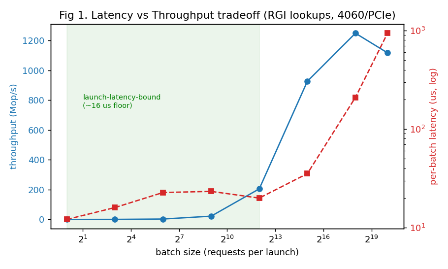
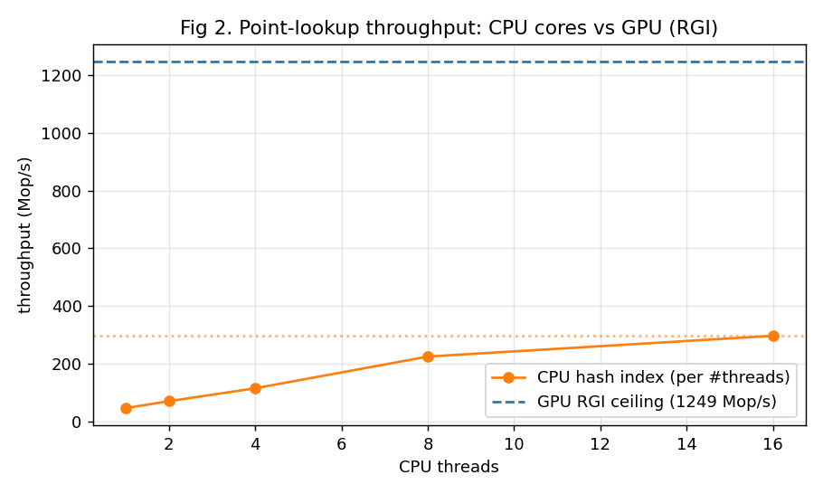
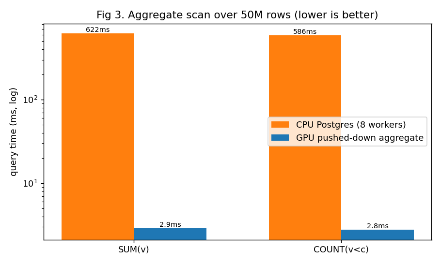
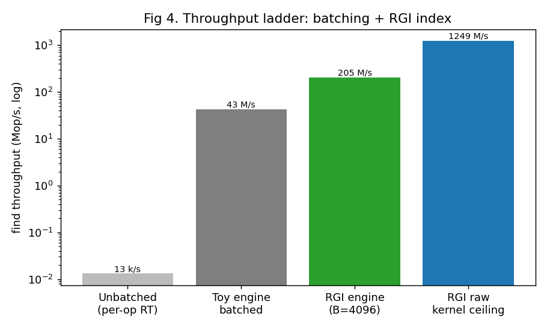

# GPU-OLTP Prototype — Performance Report

**Hardware:** RTX 4060 Laptop (Ada, 8 GB GDDR6, **PCIe** — no NVLink-C2C) · WSL2 / CUDA 12.3 / Postgres 14
**System under test:** Postgres writeable FDW → CPU↔GPU dispatch → GPU index. Two engines: a toy open-addressing hash table and the **RobustGPUIndexing (RGI)** warp-cooperative chain hashtable.
**Status:** shared multi-user transactional prototype through Postgres SQL. C2C results are **projections** (no C2C hardware here).
**Data:** all figures regenerated from a fresh benchmark run on 2026-06-08 (RTX 4060, AC power).

---

## 1. Latency vs. throughput tradeoff (the core result)

RGI point lookups, batch size swept 1 → 1M (single GPU launch per batch).

- **Two regimes.** Below ≈4k requests/batch latency is pinned at a **≈12–23 µs floor** (per-launch + PCIe dispatch overhead, *not* useful work); throughput rises 0.1 → 205 Mop/s "for free." Above ≈32k the kernel is work-bound: throughput plateaus ≈1.25 Bop/s, latency grows (35 → 939 µs).
- **Implication:** on PCIe you must batch to ≈4k+ to get throughput, paying the launch latency. A persistent kernel + C2C coherent doorbell (sub-µs) removes that floor — the whole motivation for GB-class.

## 2. Point-lookup throughput: CPU cores vs GPU

Same workload (2M-key hash index, 50 MB > L3). CPU = flat open-addressing index scaled 1→16 cores; GPU = RGI ceiling.

- **CPU:** 45.3 Mop/s (1 core) → **296 Mop/s (16 cores)**; single-op latency ≈22 ns.
- **GPU:** ceiling **≈1,249 Mop/s** (large batch); single-op latency ≈12 µs.
- **Crossover:** GPU overtakes 16-core CPU at batch ≈ 6k (measured sweep: 926 Mop/s at 32k), then ≈4.2× higher. **CPU wins latency ≈550×; GPU wins throughput ≈4.2×.**

## 3. Bandwidth-bound aggregate scan (CPU vs GPU)

`SELECT sum(v)` / `SELECT count(v<c)` over a 50M-row column resident in each device's memory; aggregate pushed to the GPU (only a scalar returns).

- GPU ≈2.9 ms vs CPU ≈620 ms → **≈215× (SQL wall)**. GPU kernel sustains ≈248 GB/s (near the 4060's HBM ceiling).
- Decomposition: ≈3–4× is raw HBM-vs-DRAM bandwidth; the rest is row-store executor overhead the GPU avoids. (This is OLAP — shown to confirm the silicon, not our OLTP headline.)

## 4. Throughput ladder — what batching + a real index unlock

Find throughput along the integration path.

- Unbatched per-op round-trip (≈75 µs single-op): **13.2 k/s** → toy batched engine: **43 M/s** → RGI engine at a moderate batch (B=4096): **205 M/s** → RGI raw kernel ceiling (B=262k): **1,249 M/s**.
- The 5 orders of magnitude come from (a) batching away per-op dispatch and (b) a warp-cooperative index.

---

## Correctness

Differential test (identical INSERT/UPDATE/DELETE/SELECT vs a Postgres heap oracle, set-diffed): **PASS** — 0 rows differ in both directions; spot checks match.

## Honest caveats

- 4060/**PCIe**: all C2C numbers are projections; GPU single-op latency is dominated by the ≈12–16 µs launch/dispatch floor. With these fresh constants the modeled GPU-beats-CPU crossover is **B≈194 (C2C, projected)** vs **B≈6,212 (PCIe, measured)**.
- GPU lookup numbers exclude host↔device key copy (kernel+dispatch only); the SQL `INSERT` time is Postgres per-row executor overhead, separate from GPU dispatch.
- Prototype scope: it's a GPU-resident **index/access-method** (32-bit row-id values, not a tuple store), shared via one GPU-service worker, with **all-or-nothing commit** (validate-the-whole-write-set-before-mutating, then no-fail apply), rollback, read-your-writes, and a **paged non-truncating scan**. Still **no write-write conflict detection (≈ Read-Committed + RYW), no subtransactions, no durability/WAL/recovery**.
